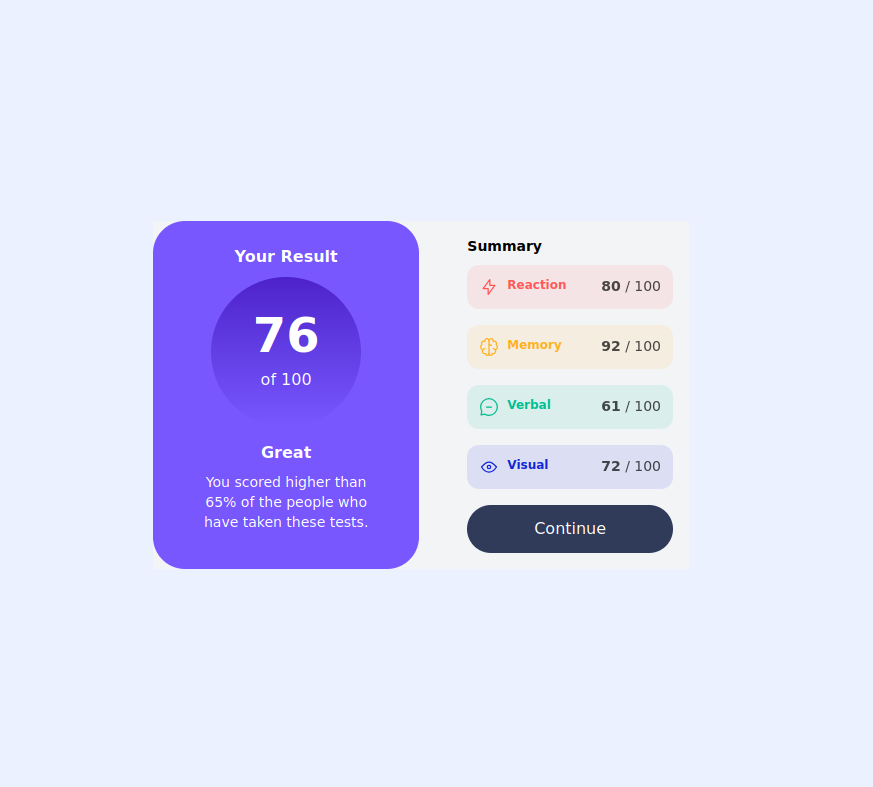
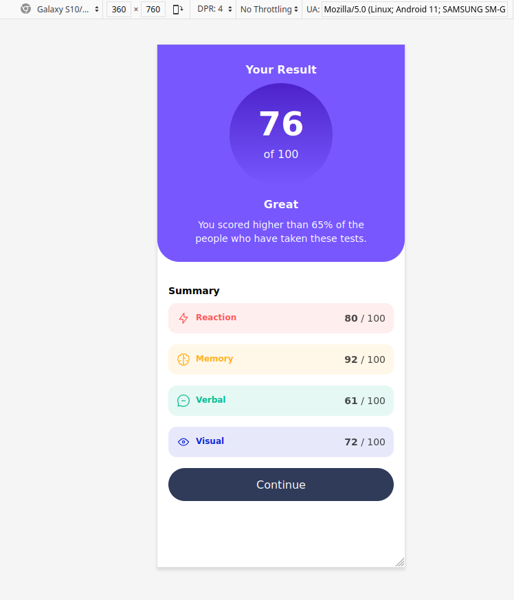

# Frontend Mentor - Results summary component solution

This is a solution to the [Results summary component challenge on Frontend Mentor](https://www.frontendmentor.io/challenges/results-summary-component-CE_K6s0maV). Frontend Mentor challenges help you improve your coding skills by building realistic projects.

## Table of contents

- [Overview](#overview)
  - [The challenge](#the-challenge)
  - [Screenshot](#screenshot)
  - [Links](#links)
- [My process](#my-process)
  - [Built with](#built-with)
  - [What I learned](#what-i-learned)
  - [Useful resources](#useful-resources)
- [Author](#author)
- [Acknowledgments](#acknowledgments)

**Note: Delete this note and update the table of contents based on what sections you keep.**

## Overview

### The challenge

Users should be able to:

- View the optimal layout for the interface depending on their device's screen size
- See hover and focus states for all interactive elements on the page
- **Bonus**: Use the local JSON data to dynamically populate the content

### Screenshot





### Links

- Solution URL: [Github repo](https://github.com/werliton/result-summary)
- Live Site URL: [Access the site](https://ws-result-summary.netlify.app/)

## My process

### Built with

- Semantic HTML5 markup
- CSS custom properties
- Flexbox
- Tailwindcss
- Mobile-first workflow
- [React](https://reactjs.org/) - JS library
- [Vite](https://vite.dev/) - Build Tool
- [Tailwindcss](https://tailwindcss.com/) - For styles

### What I learned

#### 01 - Knowledge imports

To ensure that Typescript know png import type, I created a file named type.d.ts, in accordance code below:

```javascript
declare module "*.svg" {
  const content: string;
  export default content;
}
```

#### 02 - Tailwindcss don't can to performance dynamic style

To this I have created a mapped object, similiar to below:

```javascript
const styles: {
  [key: string]: {
    text: string,
    bg: string,
    hover: string,
  },
} = {
  red: {
    text: "text-light-red",
    bg: "bg-light-red/10",
    hover: "hover:bg-light-red/20",
  },
};
```

To use `clsx lib` to merge styles:

```jsx
const { text, bg, hover } = styles[color];

<div
  className={clsx("flex justify-between p-3 rounded-xl text-xs", bg, hover)}
>
```

#### 03 - Customize theme

Using data from style-guide.md, I created an custom theme in `[index.css](./src/index.css)`

#### 04 - Responsive Layout

Using Tailwindcss resource. I create layout by Mobile first flow and using the flag `@apply`, in according to file `[index.css](./src/index.css)`

## Author

- LInkedin - [Werliton Silva](https://www.linkedin.com/in/werliton-silva/)
- Frontend Mentor - [@werliton](https://www.frontendmentor.io/profile/werliton)

## Acknowledgments

This is where you can give a hat tip to anyone who helped you out on this project. Perhaps you worked in a team or got some inspiration from someone else's solution. This is the perfect place to give them some credit.

**Note: Delete this note and edit this section's content as necessary. If you completed this challenge by yourself, feel free to delete this section entirely.**
